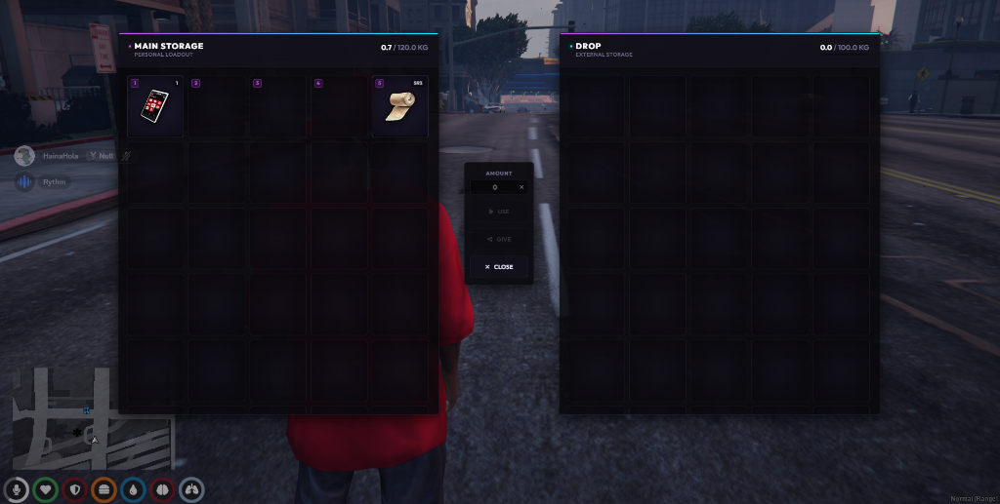

# Custom Inventory Redesign

A premium, custom-styled Cyberpunk-themed player inventory system for QBCore. Featuring sharp angular designs, solid color slate palettes (optimized for performance), custom headers with character names, and Outfit typography.

## Preview



## Features
- **Modern Minimal Cyberpunk Theme**: Solid dark panels, sleek purple accents, custom-angled borders, and clear Outfit typography.
- **Dynamic Character Headers**: Displays the actual player character's first and last name directly inside the UI.
- **Stashes**: Supports personal and shared storage stashes.
- **Vehicles**: Full support for vehicle glovebox and trunk storage.
- **Weapon Attachments**: Attach custom components to weapons in-inventory.
- **Shops & Drops**: Custom shop inventory pane and item drops.
- **Performance Optimized**: Built using solid, premium color styles—completely free of expensive backdrop filters and blurs.

## Configuration
All primary settings are configured inside the `config/` directory:
- **`config/main.lua`**: Set max slots, carry weight, shop items, drops, and default settings.
- **`html/main.css`**: Modify root variables (colors, borders, fonts) to quickly adjust the visual style of the inventory:
  ```css
  --accent-purple: #d680ff; /* Main theme accent color */
  --accent-cyan: #00e5ff;   /* Secondary highlight accent */
  --panel-bg: #0f0e15;      /* Main container background */
  ```

## Installation

### 1. Database Setup
Execute the following SQL command to create the standard `inventories` storage table (or run the included `qb-inventory.sql` file):
```sql
CREATE TABLE IF NOT EXISTS `inventories` (
  `id` INT(11) NOT NULL AUTO_INCREMENT,
  `identifier` VARCHAR(255) NOT NULL,
  `items` LONGTEXT DEFAULT ('[]'),
  PRIMARY KEY (`identifier`),
  KEY `id` (`id`)
) ENGINE=InnoDB AUTO_INCREMENT=1 DEFAULT CHARSET=utf8mb4;
```

### 2. Migrating From Old qb-inventory (Optional)
If you are upgrading from an older version of `qb-inventory` that used separate database tables for stashes, gloveboxes, and trunks:
1. Make sure you have imported the standard `inventories` table structure (Step 1 above).
2. Execute the provided `migrate.sql` query in your database:
   * This will merge the existing items from `gloveboxitems`, `stashitems`, and `trunkitems` tables directly into the new unified `inventories` table.
   * The query handles duplicate keys safely.
3. Once the migration query executes successfully, you can safely delete (drop) the old `gloveboxitems`, `stashitems`, and `trunkitems` tables from your database.

### 3. Loading Order
Since QBCore resources are typically loaded together via the `[qb]` folder category, ensure that:
- This resource is inside the `[qb]` directory.
- `qb-core` and `qb-weapons` are loaded beforehand (either by category ordering or alphabetical loading order).
```cfg
ensure [qb]
```

## Admin Commands
- `/giveitem [player_id] [item_name] [amount]` (Admin Only) — Spawns an item directly to the player.
- `/clearinv [player_id]` (Admin Only) — Clears all items in the player's inventory.
- `/randomitems` (God Only) — Spawns random starter items to test slot distribution.
